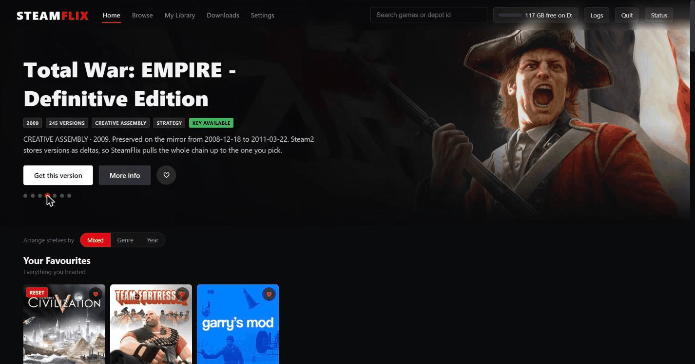

# The browser for old Steam games — SteamFlix

A local, Netflix-style browser for the Steam2 archive: search 5,600 pre-2013
titles, pick any version Valve ever shipped, and SteamFlix downloads the delta
chain, finds the decryption key and extracts a playable folder.



---

## What it does

The Steam2 archive is a mirror of Valve's original content servers. It holds
116,000 blob and dat files covering every version of thousands of games as they
were shipped between 2003 and 2013 — but as a flat directory of filenames like
`441_396_7f92e6ea_a64546b9….blob`, which is unusable by hand.

SteamFlix turns that into a catalogue you can browse:

- **5,607 titles**, grouped by game rather than by depot, with cover art,
  studio, publisher, genre and release year pulled from Steam's own metadata.
- **Filter** by genre, studio, publisher or year; sort newest-first, by studio,
  or by how deep a title's history goes. Heart the ones you want to keep.
- **Every version** of a game, not just the last one. Steam2 stores releases as
  deltas, so SteamFlix walks the chain back to version 0 and fetches only what
  that chain needs.
- **Depot resets** — where Valve wiped a depot and started over, leaving two
  different blobs sharing a version number — are followed by parent CRC, so you
  can pick which branch you want.
- **Decryption is handled for you.** The reference extractor refuses to start
  without a key even when a depot holds nothing encrypted. SteamFlix reads the
  compression modes out of the blob first and tells you which case you're in,
  then finds a working key when one is genuinely needed.
- **Runs what it extracts**, and tells you honestly when a game won't start.

It also verifies its own work: after extraction it compares what landed on disk
against the depot's manifest, so a half-extracted game is reported rather than
silently handed to you looking fine.

### If the mirrors go down

SteamFlix carries a small, purpose-built BitTorrent client. When every mirror
refuses a file it locates that file's byte range inside the 12 TiB archive
torrent, asks peers for only the 16 KiB blocks covering it, and checks the
result against the SHA-256 already in the filename. It never seeds and has no
interest in the other 12 TiB.

---

## Requirements

- Windows — the reference extractor is a Windows binary
- Python 3.9 or newer
- Three packages: `flask`, `requests`, `cryptography`

`extract.exe` is fetched from the mirror the first time you extract something.
The archive torrent is optional and only used as a fallback.

---

## Setup

```
git clone https://github.com/<you>/steamflix.git
cd steamflix
pip install -r requirements.txt
python setup.py
```

`setup.py` checks your Python and packages, asks where the library folder should
live and which port to use, finds the extractor and torrent if they're around,
and writes a `start.bat` wired to those paths.

Then double-click **start.bat**. It opens <http://127.0.0.1:8777/>.

The first run builds the catalogue from the mirror's file listings — a minute or
two. Every run after that starts instantly.

### Depot keys

Roughly 4,700 depots are encrypted. If you have the reference extractor's
`keys.cpp`, drop it in the project folder, `tools/`, or `data/` and SteamFlix
loads the table on startup. Without it, depots that hold nothing encrypted still
extract normally, and you can paste keys into any depot's dialog. The Settings →
Diagnostics report tells you exactly where it looked.

---

## Using it

**Home** opens with a rotating banner and shelves by genre and year. On the
first run it asks how much to load: a light start fetches a few short shelves
and only the cover art you can actually see, which is easiest on the mirror.

**Browse** is the whole catalogue with the filters. **Search** matches titles,
studios, publishers and depot ids.

**Clicking a title** opens its dialog:

| Button | What it does |
|---|---|
| Check size | Measures the whole delta chain before you commit to it |
| Inspect contents | Reads the manifest — file count, installed size, folders |
| Check encryption | Says whether this depot needs a real key, and whether one is known |
| Download & extract | Fetches the chain, decrypts and extracts |

A game spread across several depots lists its siblings, so you can reach the one
holding the content you actually want.

**My Library** holds what you've downloaded. *Verify files* re-checks an
extraction against its manifest; *Play* launches the game and reports the exit
code if it dies on startup.

**Settings** covers where files come from (mirrors, torrent, or both), the
mirror list, how gently to fetch, optional proxying, and a diagnostics report
that checks the whole installation end to end.

---

## Being a good guest

The mirrors are run by volunteers. SteamFlix paces itself by default — a delay
between requests, a ceiling on requests per minute, and a cap on simultaneous
connections — and every one of those is in Settings if you want it gentler.
With several downloads queued it can route part of the batch through BitTorrent
instead, so a queue of games doesn't land entirely on two donated hosts.

---

## Configuration

Set by `setup.py` in `start.bat`; all optional.

| Variable | Default | Meaning |
|---|---|---|
| `STEAMFLIX_LIBRARY` | `../library` | Where blobs, dats and extracted games go |
| `STEAMFLIX_MIRRORS` | built-in list | Comma-separated, tried in order |
| `STEAMFLIX_PORT` | `8777` | Port for the local server |
| `STEAMFLIX_BUDGET_GB` | unset | Cap SteamFlix's footprint; unset means "the drive's free space" |
| `STEAMFLIX_RESERVE_GB` | `5` | Space to leave free on the drive |
| `STEAMFLIX_TORRENT` | `../steam2.torrent` | Fallback torrent |
| `STEAMFLIX_TORRENT_FALLBACK` | `1` | `0` keeps SteamFlix strictly on HTTP |
| `STEAMFLIX_SEGMENTS` | `8` | Parallel byte ranges per large file |
| `STEAMFLIX_DL_THREADS` | `4` | Files downloaded at once |

---

## Layout

```
server.py              launcher and CLI
setup.py               first-time setup, writes start.bat
steamflix/
  api.py               the JSON API
  index.py             builds the catalogue from the mirror listings
  resolver.py          depot -> Steam app, studio, genre, year
  chain.py             delta chains, including depot resets
  blob.py              Steam2 blob and manifest parsing
  keys.py              encryption analysis and the key trial
  jobs.py              download + extract jobs
  net.py               mirrors, segmented transfers, pacing, fallback
  torrent.py           the built-in BitTorrent client
  proxies.py           optional proxy pool
  diagnostics.py       self-checks and install verification
  settings.py          user settings
  media.py             what is in an extracted game, and launching it
  storage.py           disk and budget accounting
  logbook.py           categorised error log with plain-English hints
  db.py                SQLite schema and helpers
web/
  index.html style.css app.js      the front end; no build step, no npm
```

---

## Notes

SteamFlix is a client for an archive you already have access to. It ships no
game content, no mirror credentials, and no keys beyond those already published
in the reference extractor's own source.
